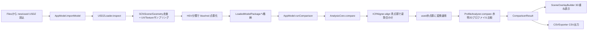

# 3D解析 開発ドキュメント（データフロー / アルゴリズム×実装 / 開発で詰まりやすい点）

## 目的
このドキュメントは、TireShoulderPoC の3D解析部分について、次の3点を1つにまとめた「実装者向けガイド」です。

1. データの流れ（入力→抽出→位置合わせ→比較→出力）
2. 各解析アルゴリズムとプログラムファイルの対応関係
3. Git履歴から読み解く、実際に動くまで苦労したポイントと注意点

---

## 1. データフロー（実装目線）

### データが流れる際の「単位」
- `USDZLoader` は三角形重心ベースでサンプル点を作る（頂点そのものではない）。
- 解析本体は `SIMD3<Float>` の点群に変換して処理する。
- 距離系は計算中はメートル、表示・CSVではmmへ換算する。

### 実運用での分岐（自動抽出と手動領域）
- 通常は `bluePoints` / `redPoints` を自動抽出して比較。
- デバッグUIで Manual Region（alignment/comparison）を設定すると、比較直前に有効点群を組み立て直す。
- この設計により `AnalysisCore` 側を大きく変えずに、手動選択パスを追加している。

---

## 2. 解析アルゴリズムとプログラムファイルの関係

## A. オーケストレーション
- **`TireShoulderPoC/AnalysisCore.swift`**
  - 役割: 解析手順の骨格だけを持つ。
  - 処理順: `ICPAligner.align` → `transformPoints` → `ProfileAnalyzer.compare`。
  - 設計意図: 「何をどの順番で呼ぶか」に集中し、アルゴリズム詳細は各モジュールに分離。

## B. 入口・状態管理
- **`TireShoulderPoC/AppModel.swift`**
  - 役割: UIイベントから解析パイプラインを起動。
  - `importModel`: `USDZLoader.inspect` を非同期実行して `LoadedModelPackage` 化。
  - `runComparison`: 実効パッケージを整えて `AnalysisCore.compare` 実行。
  - 注意点: `@MainActor` と `Task.detached` の境界を守る（UIと重処理の分離）。

## C. USDZ→点群抽出（最重要の不安定ポイント）
- **`TireShoulderPoC/USDZLoader.swift`**
  - 役割: SceneKit / Model I/O 経由で material/texture を辿り、UVから色を読む。
  - 主要アルゴリズム:
    - UV位置でテクスチャ色サンプリング（bilinear）
    - RGB→HSV分類（blue/red/other）
    - voxelダウンサンプル
  - 実装上のキモ:
    - `sampleImage(at:)` で **V軸を `uv.y` と `1-uv.y` の両方評価**し、色らしさスコアの高い方を採用。
    - これにより、USD/SceneKit/Model I/Oで発生するUV向き差に耐える。

## D. 青領域位置合わせ
- **`TireShoulderPoC/ICP.swift`**
  - 役割: 青点群の剛体位置合わせ。
  - 主要アルゴリズム:
    1. PCA初期姿勢（符号反転4候補を評価）
    2. point-to-point ICP
    3. trim対応点（上位80%など）で外れ値耐性を持たせる
  - 実装上のキモ:
    - 初期値が悪いと局所解に入るため、PCA候補比較が効く。
    - `minimumMaskPoints` ガードで、点数不足を早期に落とす。

## E. 赤帯プロファイル比較
- **`TireShoulderPoC/ProfileAnalyzer.swift`**
  - 役割: 位置合わせ後の赤点群を1D比較へ落とし込む。
  - 主要アルゴリズム:
    1. PCA平面へ投影
    2. `|z|` しきい値で近傍平面点に限定
    3. x-binごとにy中央値
    4. 欠損補間 + 移動平均
    5. `delta = new-used` と統計値計算
    6. 端部アンカーで符号方向を自動統一
  - 実装上のキモ:
    - 投影後に点が急減するため、各段階で最低点数チェックが必要。
    - 符号向き統一をしないと、同じ形でも差分の正負が逆転しうる。

## F. 表示・出力
- **`TireShoulderPoC/SceneOverlayBuilder.swift`**: 変換後の3D重ね表示を構築。
- **`TireShoulderPoC/CSVExporter.swift`**: 指標・サンプル列をCSV化。
- **`TireShoulderPoC/DebugInspectorView.swift`**: 調査用可視化（抽出品質と失敗原因の切り分け）。

---

## 3. Git履歴から見える開発経緯（3D解析で本当に苦労した点）

以下は `git log` の流れを、3D解析の観点で要約したものです。

## フェーズ1: まず動く抽出・診断基盤を作る
- `b04e9e1`: debug inspector + robust mask extraction パイプライン追加。
- `de32a3d`〜`c8edf27`: Model I/O baseColor 診断・texture読込補強。

**学び**
- 3D解析が不安定なとき、まず「点群が本当に正しく取れているか」を可視化できる状態にする。
- いきなりICP/数式を疑うのではなく、入力品質を検証する導線が重要。

## フェーズ2: 色抽出の精度改善（誤分類対策）
- `7f58859` / `b5ae4d2`: HSV診断ログを強化。
- `240b250` / `052b2cf`: near-color-rich 系フィルタ導入。
- `43ebc19`: extraction mode 切替（simple threshold パス併設）。

**学び**
- 低照度・ハイライト環境では単純HSVだけだと破綻しやすい。
- 強化版アルゴリズムを入れる際、単純版を残して比較可能にするとデバッグが速い。

## フェーズ3: ROI/Brushで対象領域を制御
- `260844a`〜`7dca4eb`: ROI-aware inspect と crop brush 導入。
- `e180fc4` / `042777c`: ブラシ操作とInspector UXを改善。
- `7a4699c` / `f3ca4e2`: alignment/comparison の手動領域を比較処理へ直接反映。

**学び**
- 自動抽出が難しい現場データでは「人が最後に介入できる導線」が成功率を大きく上げる。
- ただし、Manual Region は new/used 両側でセットしないと比較が成立しないため、バリデーション必須。

## フェーズ4: 直近の核心バグ修正（赤青0件問題）
- `e585ce5`: 色検出と手動ブラシ安定化。
- `85b94f3`: RGB sampling 修正で red/blue mask を回復。

**学び**
- 直近で最もクリティカルだったのは「UV/textureサンプリングの取り方」。
- アルゴリズム以前に、**どの画素を読んでいるか** がズレると全段が崩れる。

---

## 4. 3D解析部分の開発で注意すべきポイント（再発防止チェックリスト）

## 4.1 まず入力点群品質を固定してから解析を触る
- 変更前後で `blue/red count`、`rawBlue/rawRed`、`totalSamples` を比較。
- Debug Inspector で「抽出点が意図した帯に乗っているか」を必ず目視確認。

## 4.2 UV/Textureは「読み取り経路差」を前提に設計する
- SceneKit/Model I/O/エクスポータ差でUV向き・material参照がぶれる。
- サンプリング関数は、単一仮定（例: V軸固定）を置かずフォールバックを持たせる。

## 4.3 ICP失敗は「点数不足」「対称性」「初期値」を疑う
- `minimumMaskPoints` 未満は即失敗扱いにする。
- 青テープが対称だと姿勢が滑りやすいので、現場側の貼り方ルール化が必要。
- PCA初期化候補の評価ロジックを削ると再現性が落ちやすい。

## 4.4 プロファイル比較は投影後の欠損が本番
- 投影→平面近傍フィルタで点が減るのが正常挙動。
- 欠損補間と平滑化のパラメータを同時に変えると原因切り分け不能になる。
- 符号統一ロジックを無効化すると、解釈時に正負が頻繁に逆転する。

## 4.5 手動領域機能は「可用性」と「整合性」を分けて設計する
- 操作しやすいUI（ブラシ・フォーカス）と、解析入力の整合性チェック（両側必須）は別責務。
- `AnalysisCore` を汚さず、`AppModel` で有効パッケージ組み立てる方針は保守しやすい。

---

## 5. 実装者向け: 変更時の推奨手順
1. `USDZLoader` の変更時は、まず Inspector で色抽出点を確認。
2. 次に `runComparison` を実行し、青RMS/比較点数を確認。
3. `ProfileAnalyzer` を触る場合は、
   - overlap length
   - 有効サンプル数
   - `meanAbs/p95/max`
   をセットで比較。
4. 手動領域系を変更したら、
   - 自動抽出のみ
   - 手動alignmentのみ
   - 手動comparisonのみ
   - 両方手動
   の4パターンで破綻しないか検証。

---

## 6. 関連ドキュメント
- `docs/algorithm-spec.md`（数式・仕様寄り）
- `docs/architecture.md`（構成図寄り）
- 本書 `docs/3d-analysis-development-notes.md`（実装/運用寄り）

