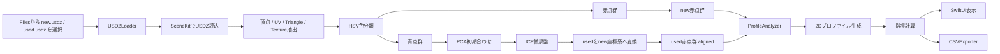
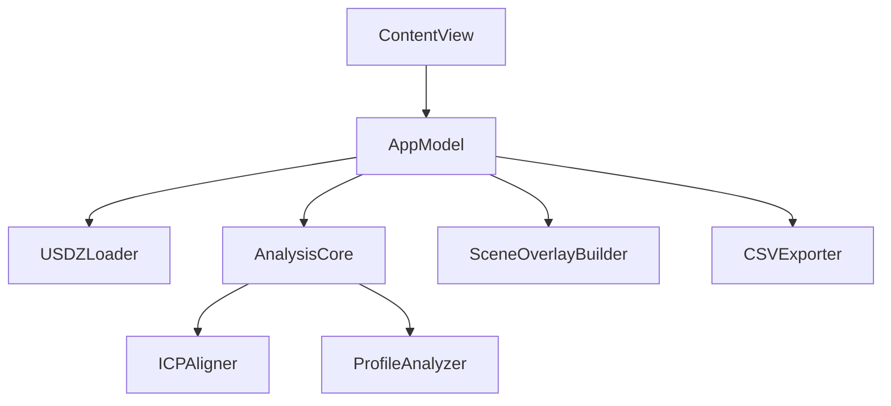

# アーキテクチャ図

## 全体フロー

---

## コンポーネント図

---

## 責務

## ContentView
- UI
- ファイル選択
- 実行ボタン
- 結果表示
- CSV共有

## AppModel
- 画面状態の保持
- 非同期処理の起点
- 読込 / 比較 / CSV出力の制御

## USDZLoader
- SceneKitでUSDZ読込
- geometry, UV, triangle, texture 走査
- 青 / 赤点群抽出

## AnalysisCore
- 全体比較処理のオーケストレーション

## ICPAligner
- 青点群の位置合わせ
- PCA初期化 + ICP

## ProfileAnalyzer
- 赤帯を2D断面化
- 1Dプロファイル化
- 差分・統計値算出

## SceneOverlayBuilder
- 新品 / 走行品を1つのSceneへ重ねる

## CSVExporter
- 結果のCSV化

---

## スレッド境界

- `AppModel` は `@MainActor`
- 重い解析は `Task.detached`
- 解析結果だけ MainActor に戻す
- 3D表示用の `SCNScene` 生成は UI 側で行う

---

## 最初の改善ポイント

1. `USDZLoader` の色抽出を UI 調整可能にする  
2. `ICPAligner` を kd-tree 化する  
3. `ProfileAnalyzer` を geodesic 中心線へ置き換える  
4. `SceneOverlayBuilder` に差分 heatmap を追加する  
